# Immune Repertoire Analysis — Results Document

**Date:** June 14, 2026  
**Data Source:** iReceptor AIRR-seq Data Commons (COVID-19 studies)  
**Total Repertoires:** 100 (85 with complete metadata)

---

## Table of Contents

1. [Cohort Description & Metadata Overview](#1-cohort-description--metadata-overview)
   - 1.1 [Data Source & Study Composition](#11-data-source--study-composition)
   - 1.2 [Disease Category Distribution](#12-disease-category-distribution)
   - 1.3 [Sex Distribution](#13-sex-distribution)
   - 1.4 [Age Distribution](#14-age-distribution)
   - 1.5 [Cross-Stratification: Disease × Sex](#15-cross-stratification-disease--sex)
   - 1.6 [Cross-Stratification: Disease × Age](#16-cross-stratification-disease--age)
   - 1.7 [Study × Disease Composition](#17-study--disease-composition)
   - 1.8 [Heatmap: Disease × Age × Sex](#18-heatmap-disease--age--sex)
2. [Clonal Analysis](#2-clonal-analysis)
   - 2.1 [Clone Count](#21-clone-count)
   - 2.2 [Clone Size](#22-clone-size)
   - 2.3 [Top X Clone Fraction (Repertoire Dominance)](#23-top-x-clone-fraction-repertoire-dominance)
3. [Summary of Key Findings](#3-summary-of-key-findings)

---

## 1. Cohort Description & Metadata Overview

### 1.1 Data Source & Study Composition

The dataset consists of **100 repertoires** drawn from **3 COVID-19 studies** retrieved via the iReceptor AIRR-seq Data Commons API. Of these, **85 repertoires** had complete metadata (age, sex, disease stage) and were used for all downstream analyses. The remaining 15 lacked metadata fields.

**Figure 1.1.** Number of subjects per dataset (study).

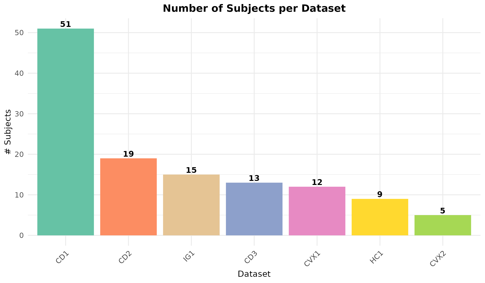

---

### 1.2 Disease Category Distribution

Raw disease stage annotations were harmonized into 5 categories:

| Category | Description | N |
|---|---|---|
| **COVID Naive** | No prior SARS-CoV-2 infection | 8 |
| **Mild** | Non-severe / mild COVID-19 | 38 |
| **Moderate** | Stable or improving COVID-19 | 9 |
| **Recovered** | Post-COVID recovery | 12 |
| **Severe** | Severe / hypoxemic COVID-19 | 18 |

The **Mild** group is the largest (n=38, 45%), followed by **Severe** (n=18, 21%), **Recovered** (n=12, 14%), **Moderate** (n=9, 11%), and **COVID Naive** (n=8, 9%).

**Figure 1.2.** Number of subjects per disease category.

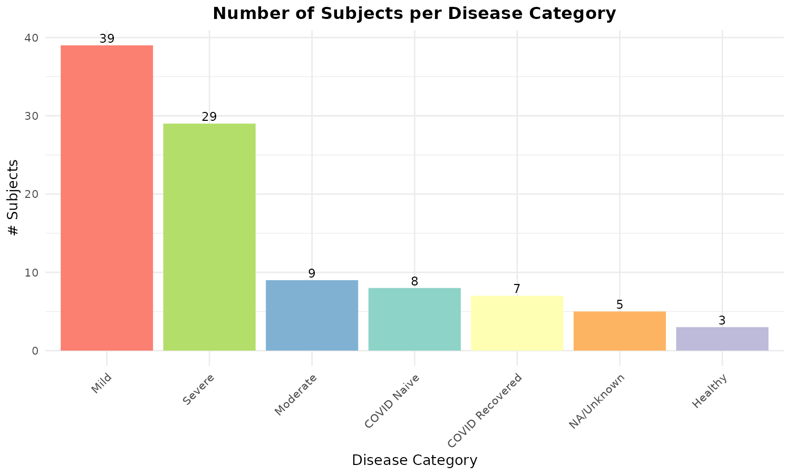

---

### 1.3 Sex Distribution

The cohort has a slight male skew: **51 males (60%)** and **34 females (40%)**.

**Figure 1.3.** Number of subjects by sex.

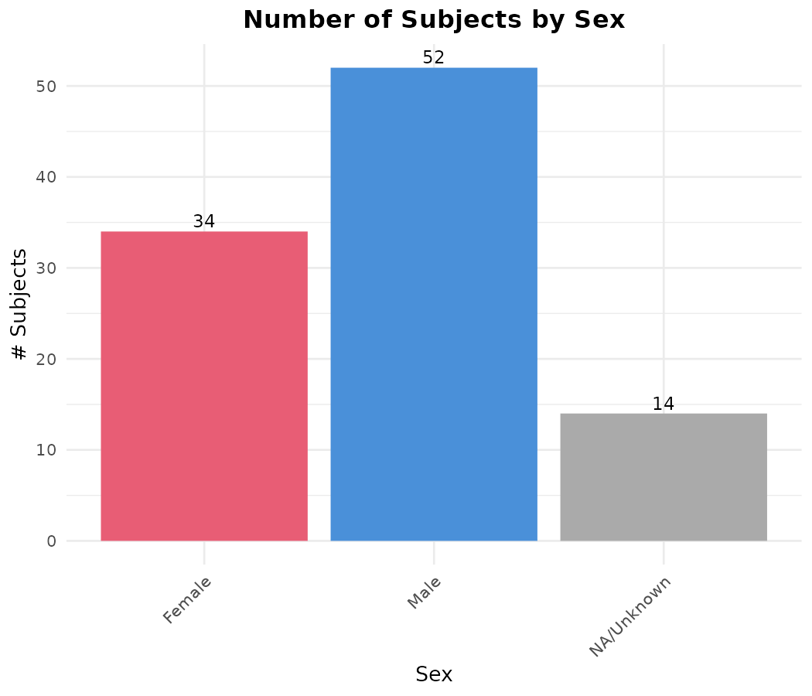

---

### 1.4 Age Distribution

Age ranges from 18 to 88 years (median ≈ 55). The age group breakdown is:

| Age Group | N |
|---|---|
| 18–30 | 10 |
| 31–50 | 25 |
| 51–65 | 29 |
| 66+ | 21 |

The cohort skews older, with 59% of participants aged 51+.

**Figure 1.4a.** Age distribution (histogram with density overlay).

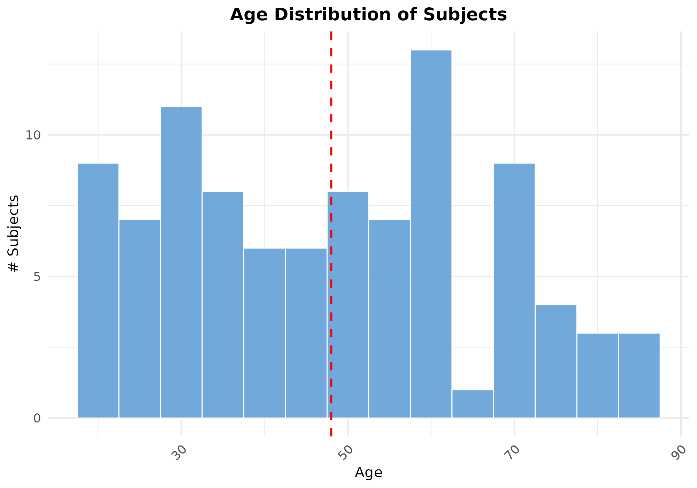

**Figure 1.4b.** Number of subjects per age group.

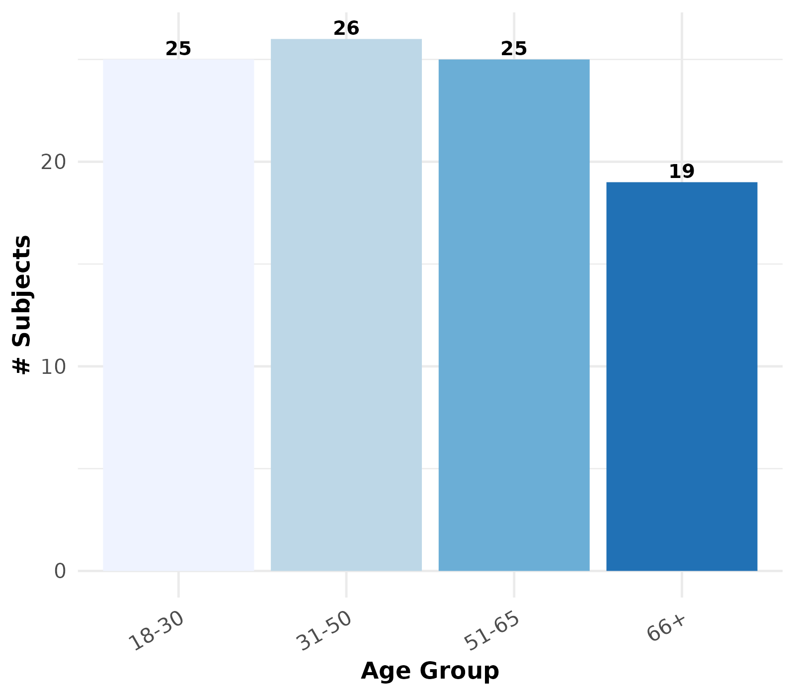

---

### 1.5 Cross-Stratification: Disease × Sex

Males are overrepresented in Severe (12M vs 6F) and Mild (22M vs 16F) groups. COVID Naive is balanced (4M, 4F). Recovered has more males (8M vs 4F).

**Figure 1.5.** Disease category distribution stratified by sex.

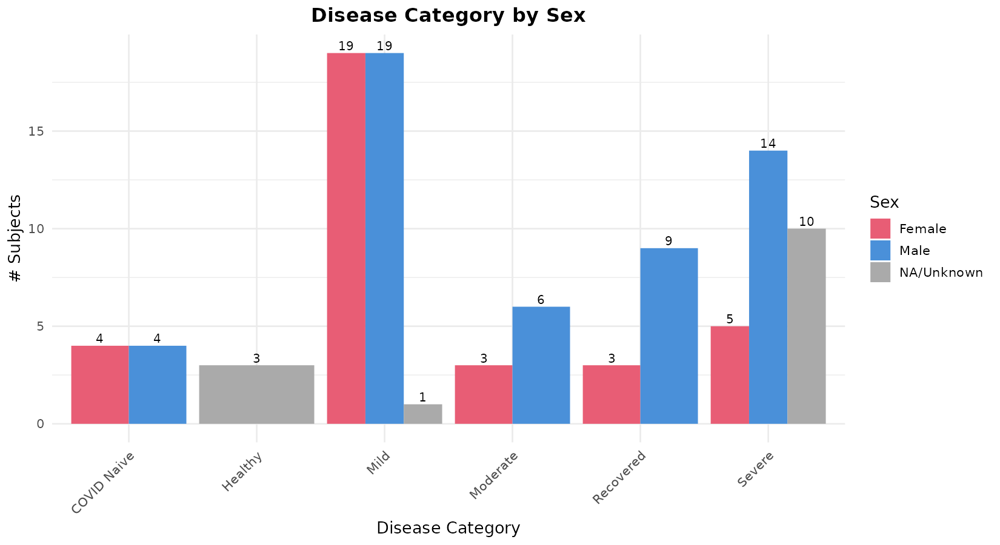

---

### 1.6 Cross-Stratification: Disease × Age

Older participants (51–65, 66+) are concentrated in the Severe group. The Mild group has the most even age distribution. COVID Naive participants tend to be younger.

**Figure 1.6.** Disease category distribution stratified by age group.

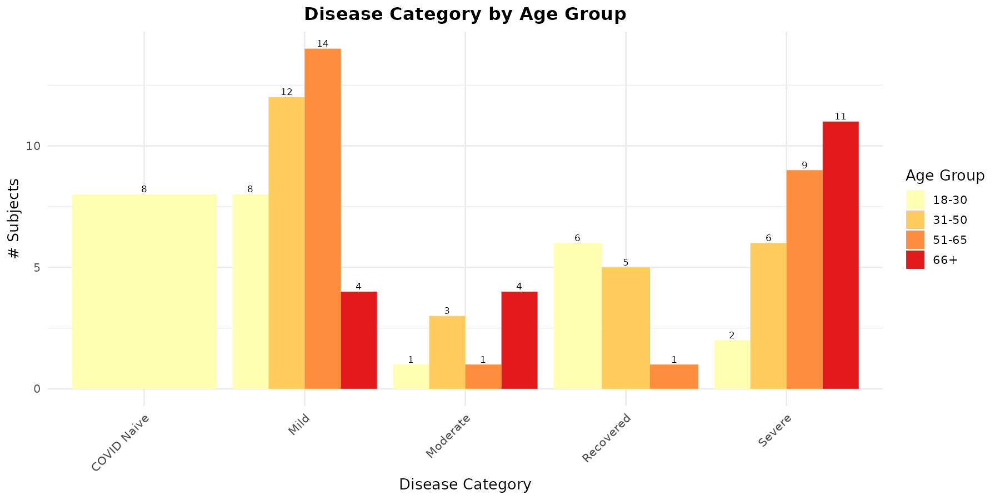

---

### 1.7 Study × Disease Composition

Different studies contributed different disease categories — disease confounds with study of origin, which is an important consideration for interpretation.

**Figure 1.7.** Study-level composition by disease category.

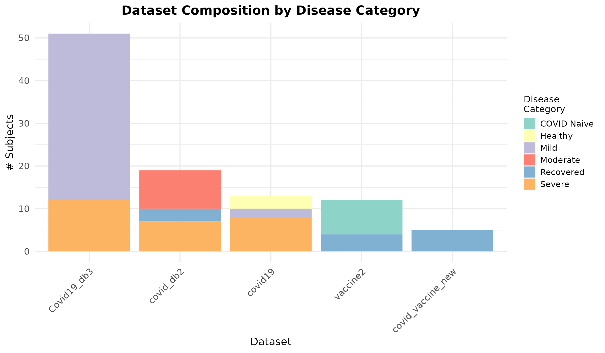

---

### 1.8 Heatmap: Disease × Age × Sex

**Figure 1.8a.** Age distribution by disease category (boxplot).

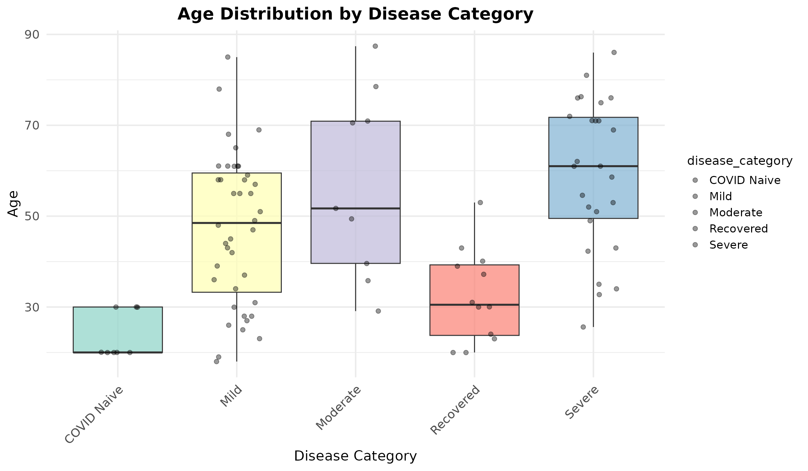

**Figure 1.8b.** Heatmap of participant counts across disease category, age group, and sex.

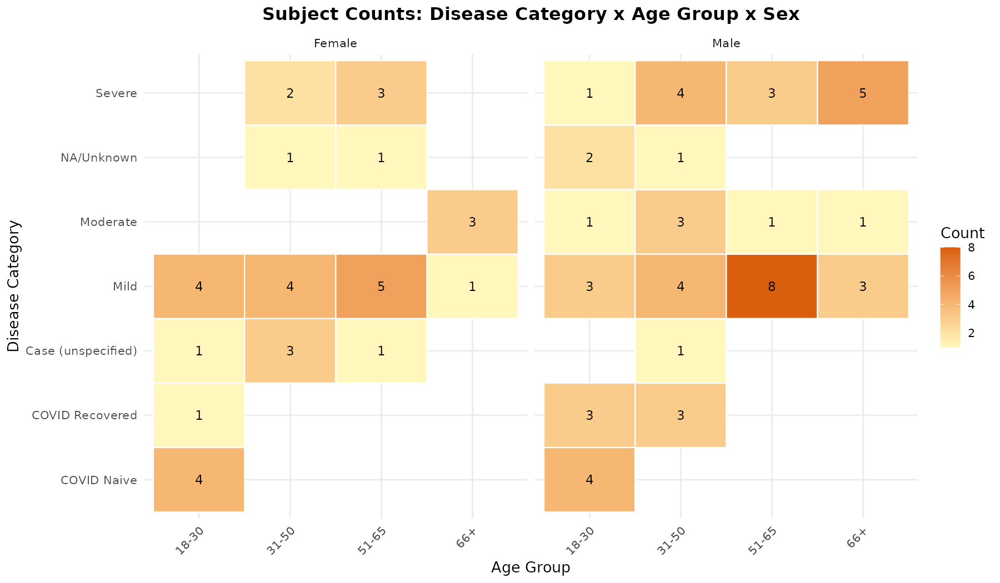

---

## 2. Clonal Analysis

### 2.1 Clone Count

Clone count represents the **number of unique B-cell clones** identified in each repertoire. Higher clone counts reflect greater clonal diversity.

#### 2.1.1 Clone Count by Disease Category

| Disease Category | N | Median | Mean | Min | Max |
|---|---|---|---|---|---|
| COVID Naive | 8 | 16,682 | 18,086 | 8,156 | 29,178 |
| Mild | 38 | 2,353 | 2,593 | 95 | 5,997 |
| Moderate | 9 | 5,085 | 9,327 | 3,459 | 22,480 |
| Recovered | 12 | 21,527 | 19,661 | 5,713 | 33,699 |
| Severe | 18 | 3,423 | 6,782 | 1,319 | 22,452 |

**Key finding:** Recovered and COVID Naive individuals have the highest clone counts (median ~17K–22K), suggesting greater clonal diversity. Mild cases have the lowest (median ~2,350), likely reflecting differences in sequencing depth or sampling across studies rather than a biological signal alone.

**Figure 2.1.1.** Clone count by disease category.

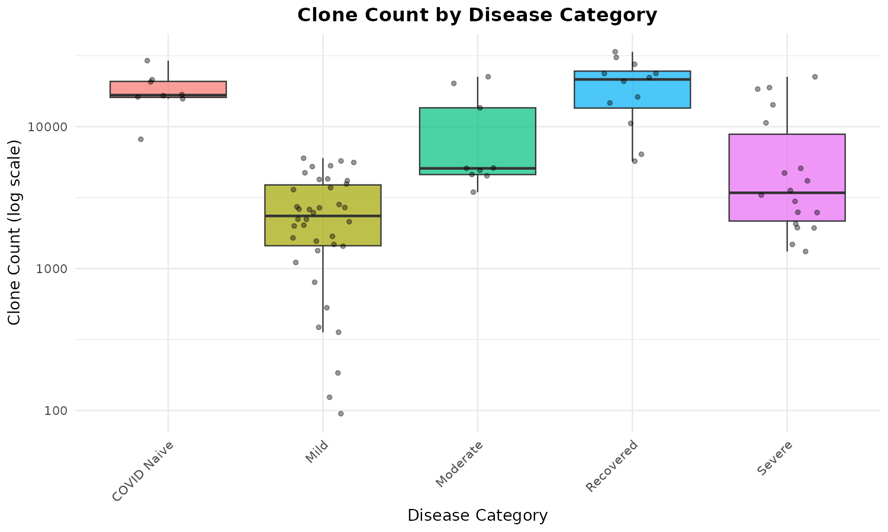

#### 2.1.2 Clone Count by Sex

| Sex | N | Median | Mean |
|---|---|---|---|
| Female | 34 | 4,002 | 7,073 |
| Male | 51 | 4,244 | 8,719 |

Clone counts are comparable between sexes, with males showing a slightly higher mean driven by outliers.

**Figure 2.1.2.** Clone count by sex.

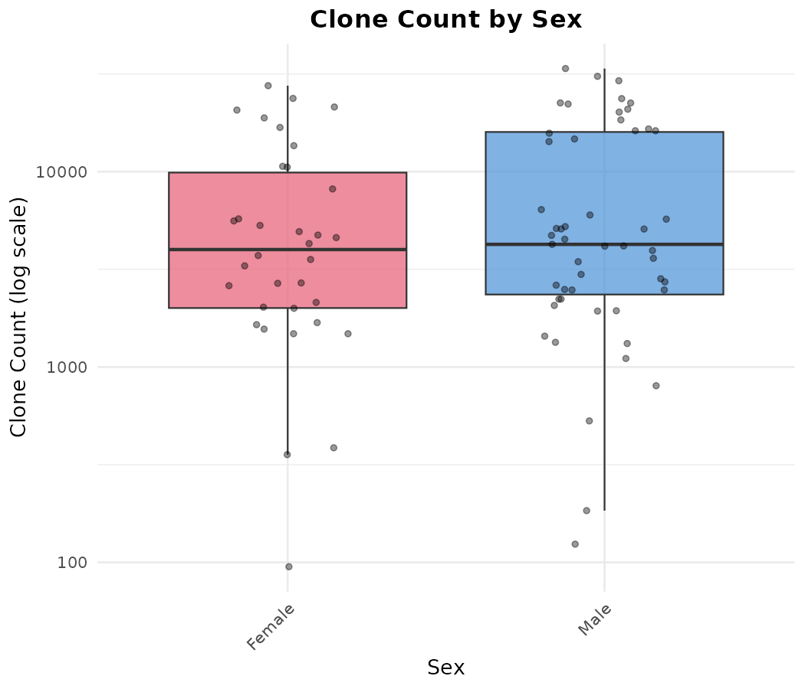

#### 2.1.3 Clone Count by Age Group

**Figure 2.1.3.** Clone count by age group.

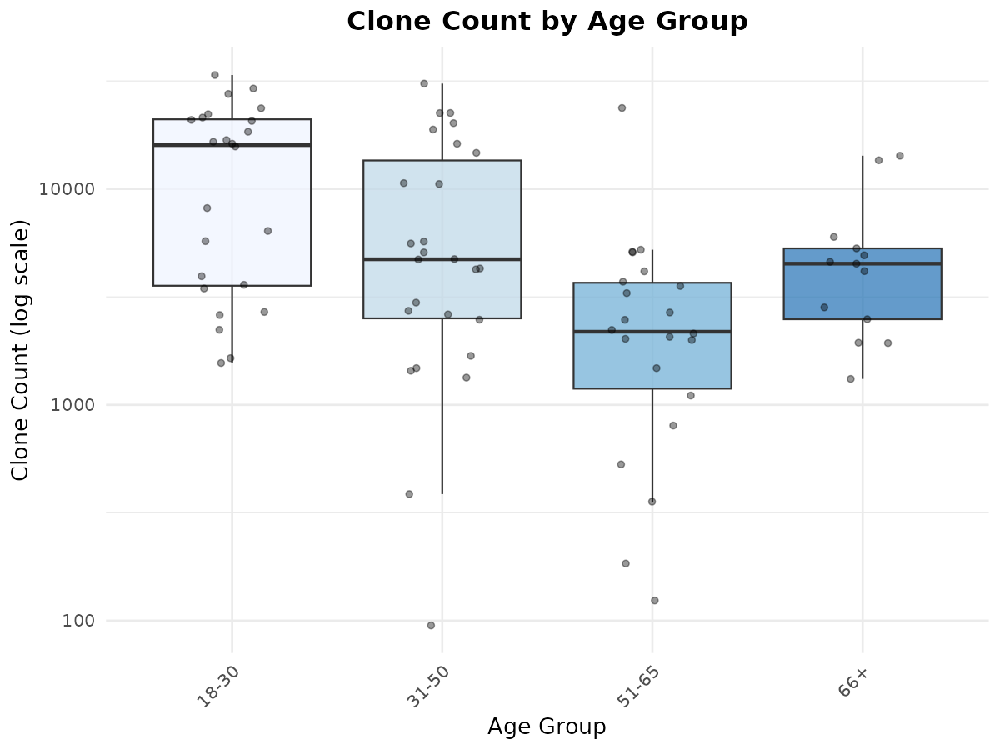

#### 2.1.4 Clone Count by Disease × Sex

**Figure 2.1.4.** Clone count by disease category and sex.

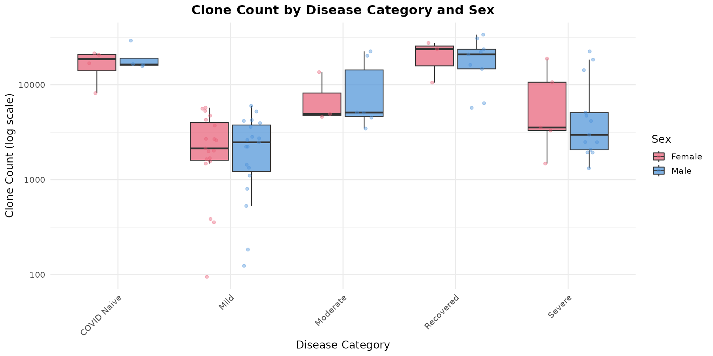

#### 2.1.5 Clone Count by Disease × Age

**Figure 2.1.5.** Clone count by disease category and age group.

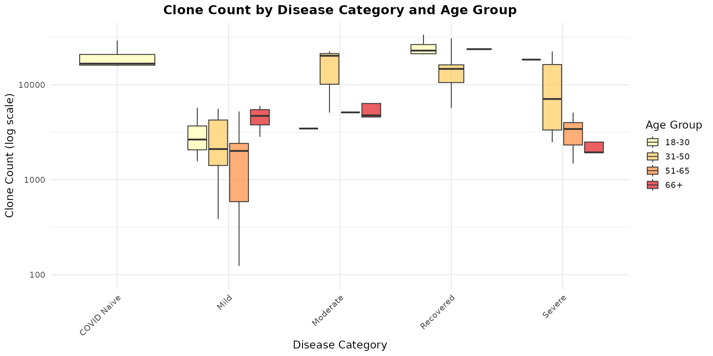

---

### 2.2 Clone Size

Clone size represents the **mean number of sequences per clone** within each repertoire. Larger clone sizes indicate greater clonal expansion (i.e., individual clones have proliferated more).

#### 2.2.1 Mean Clone Size by Disease Category

| Disease Category | N | Median (Mean CS) | Mean (Mean CS) |
|---|---|---|---|
| COVID Naive | 8 | 114.0 | 126.0 |
| Mild | 38 | 36.4 | 48.5 |
| Moderate | 9 | 63.5 | 60.0 |
| Recovered | 12 | 66.9 | 79.3 |
| Severe | 18 | 53.4 | 52.0 |

**Key finding:** COVID Naive individuals show the highest mean clone size (median 114), suggesting that even without COVID infection, their baseline repertoire features larger expanded clones. Mild cases show the smallest clones (median 36.4), consistent with a less intense immune response or earlier sampling. Severe and Moderate groups show intermediate expansion.

**Figure 2.2.1.** Mean clone size by disease category.

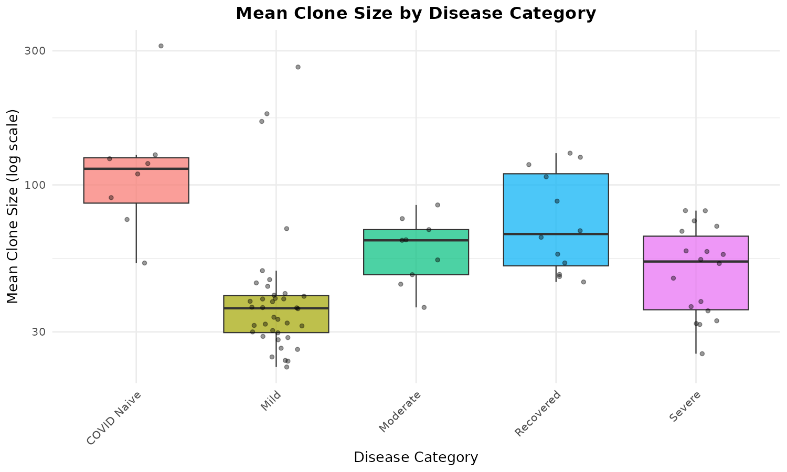

#### 2.2.2 Mean Clone Size by Sex

**Figure 2.2.2.** Mean clone size by sex.

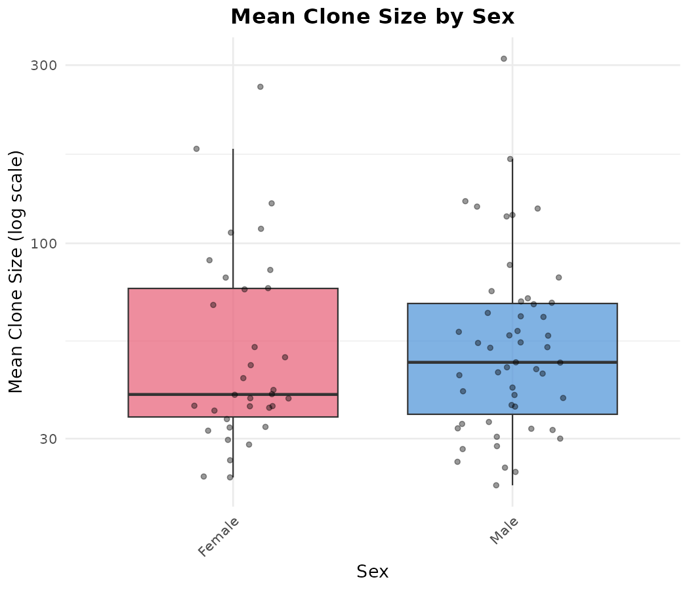

#### 2.2.3 Mean Clone Size by Age Group

**Figure 2.2.3.** Mean clone size by age group.

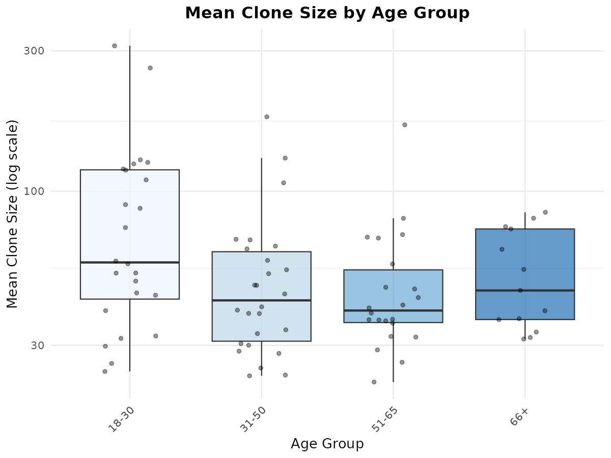

#### 2.2.4 Mean Clone Size by Disease × Sex

**Figure 2.2.4.** Mean clone size by disease category and sex.

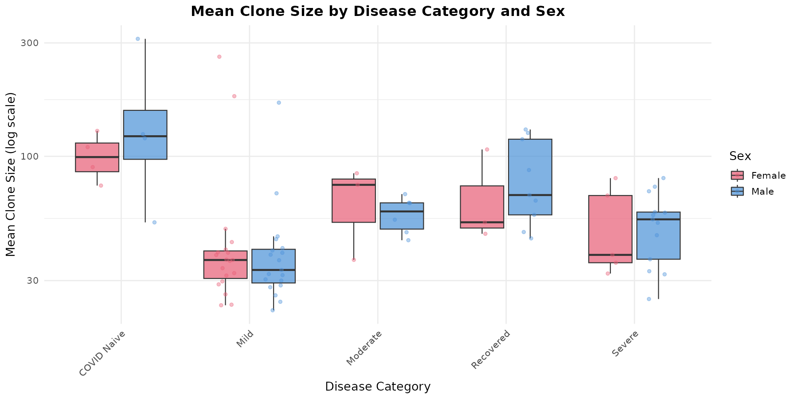

---

### 2.3 Top X Clone Fraction (Repertoire Dominance)

The Top X clone fraction measures the **proportion of total sequence copies** accounted for by the top 10, 100, or 1,000 clones. Higher fractions indicate greater oligoclonal dominance — a few clones dominate the repertoire.

#### 2.3.1 Top X Fractions by Disease Category

| Disease Category | N | Top 10 (median) | Top 100 (median) | Top 1000 (median) |
|---|---|---|---|---|
| COVID Naive | 8 | 14.4% | 61.0% | 83.3% |
| Mild | 38 | 10.5% | 30.4% | 72.7% |
| Moderate | 9 | 22.6% | 45.5% | 74.1% |
| Recovered | 12 | 16.2% | 40.3% | 76.9% |
| Severe | 18 | 16.6% | 35.6% | 74.4% |

**Key findings:**
- **Moderate** disease shows the highest Top 10 dominance (22.6%), suggesting highly focused clonal responses in patients with stable/improving disease.
- **COVID Naive** has the highest Top 100 and Top 1000 fractions (61% and 83%), indicating an oligoclonal baseline repertoire.
- **Mild** cases show the lowest dominance across all tiers (10.5% Top 10), consistent with a more polyclonal, less focused response.

**Figure 2.3.1.** Top X clone fractions by disease category (faceted by Top 10, 100, 1000).

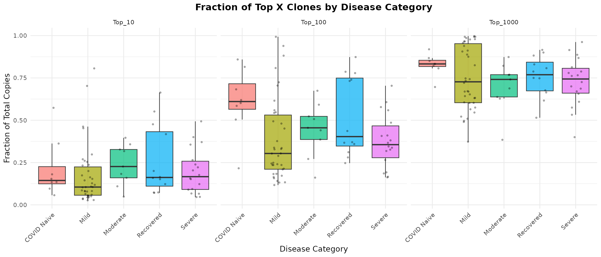

#### 2.3.2 Top X Fractions by Sex

**Figure 2.3.2.** Top X clone fractions by sex.

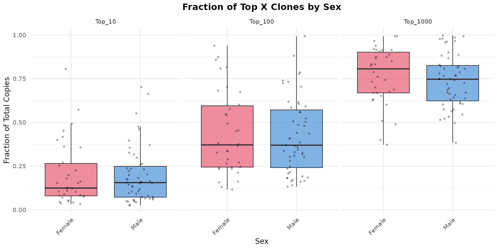

#### 2.3.3 Top X Fractions by Age Group

**Figure 2.3.3.** Top X clone fractions by age group.

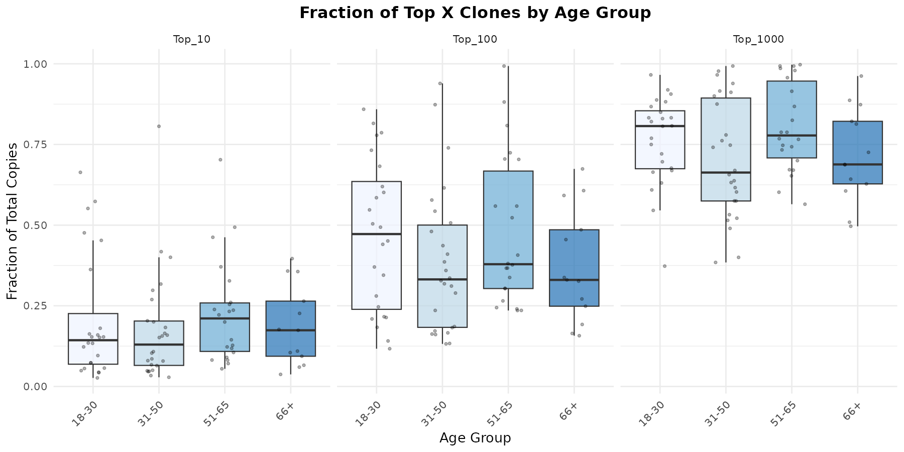

#### 2.3.4 Top 10 Clone Fraction by Disease × Sex

**Figure 2.3.4.** Top 10 clone fraction by disease category and sex.

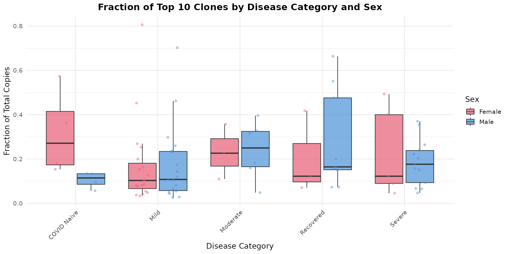

#### 2.3.5 Top 10 Clone Fraction by Disease × Age

**Figure 2.3.5.** Top 10 clone fraction by disease category and age group.

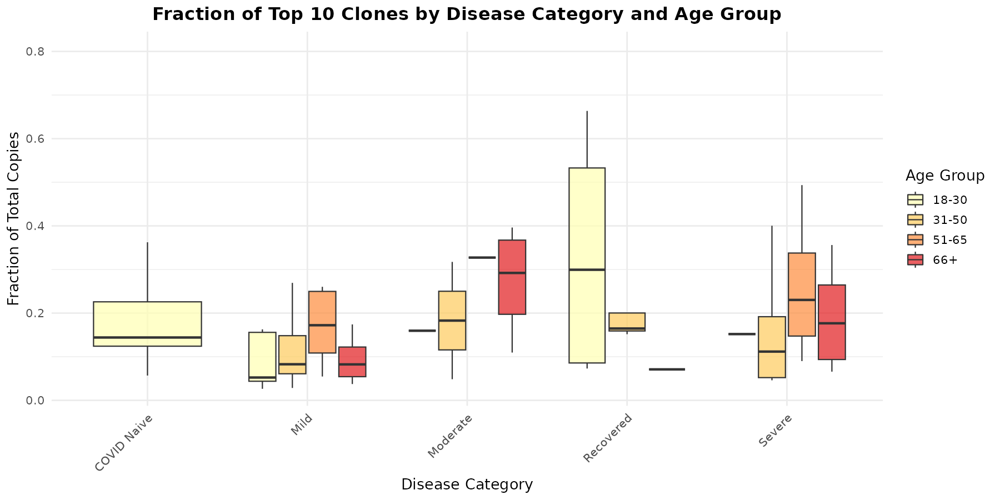

---

## 3. Summary of Key Findings

1. **Cohort composition:** 85 participants across 5 disease categories (Mild is the largest group at 45%). The cohort skews male (60%) and older (59% aged 51+). Severe cases are enriched for older males.

2. **Clone count (clonal diversity):** Recovered and COVID Naive individuals have 5–8× more unique clones than Mild or Severe cases. This likely reflects both biological differences (post-infection expansion, baseline diversity) and technical variation (sequencing depth across studies).

3. **Clone size (clonal expansion):** COVID Naive subjects show the largest average clone sizes (median 114 sequences/clone), 3× higher than Mild cases (36). This suggests substantial baseline clonal expansion even without COVID infection.

4. **Repertoire dominance (Top X fractions):** Moderate disease shows the most oligoclonal repertoire (Top 10 clones = 22.6% of copies), while Mild cases are the most polyclonal (10.5%). This pattern is consistent with focused immune responses in more symptomatic disease.

5. **Sex differences:** Minimal differences in clone count or size between males and females across all disease categories.

6. **Age effects:** No strong age-dependent trends in clonal metrics were observed, though the age × disease confound (older patients in Severe group) limits interpretation.

7. **Caveats:** Disease category confounds with study of origin. Differences in sequencing depth, library preparation, and sample timing across studies may contribute to observed variation. These results should be interpreted as exploratory.

---

*Generated from iReceptor AIRR Data Commons API data. Analysis scripts: `metadata_visualization.R`, `clonal_analysis.R`.*
